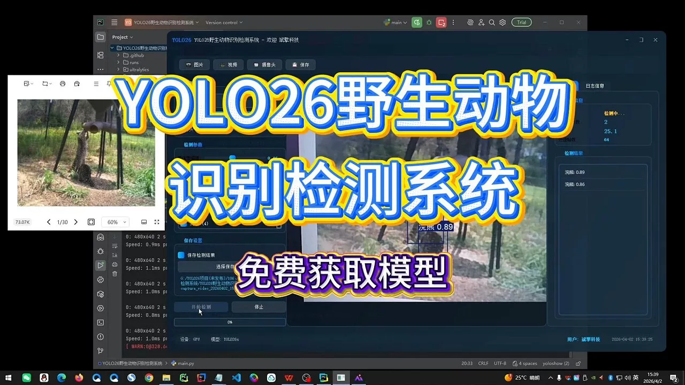
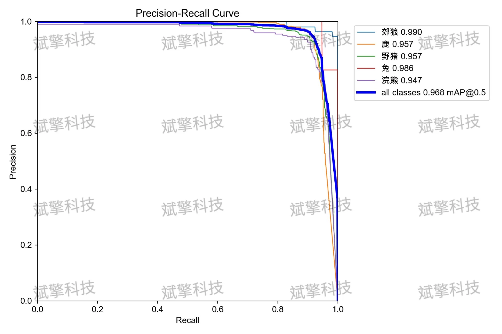
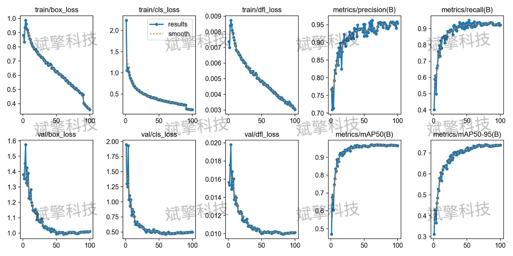
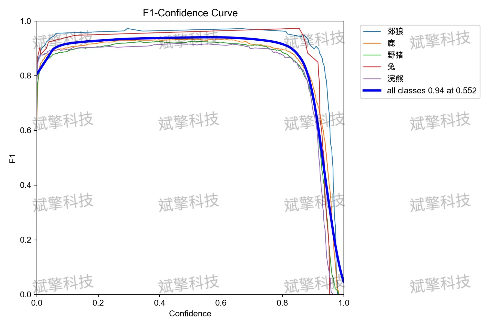
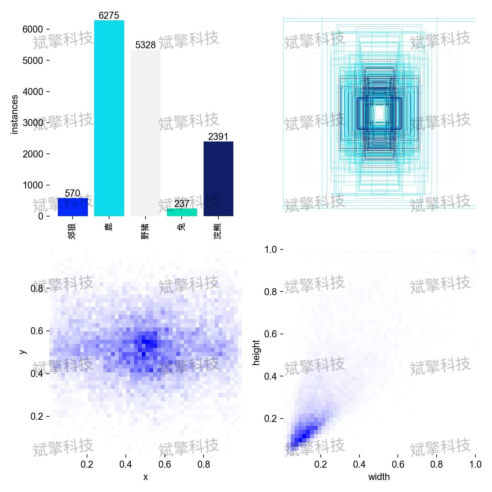
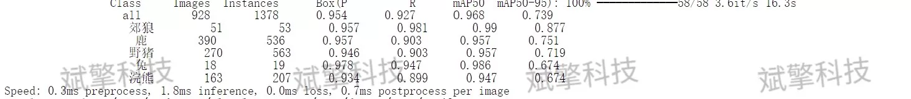
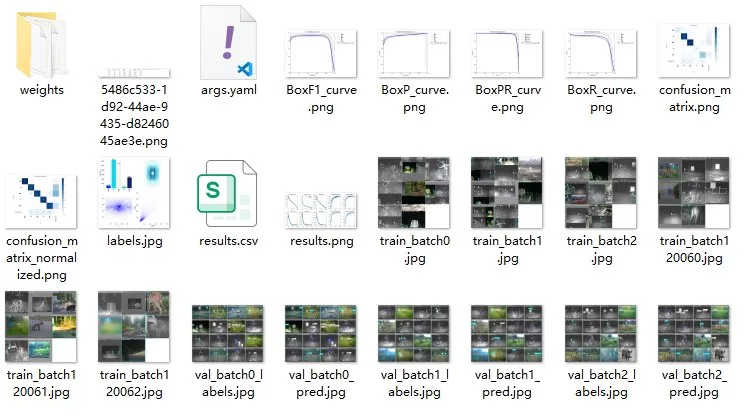
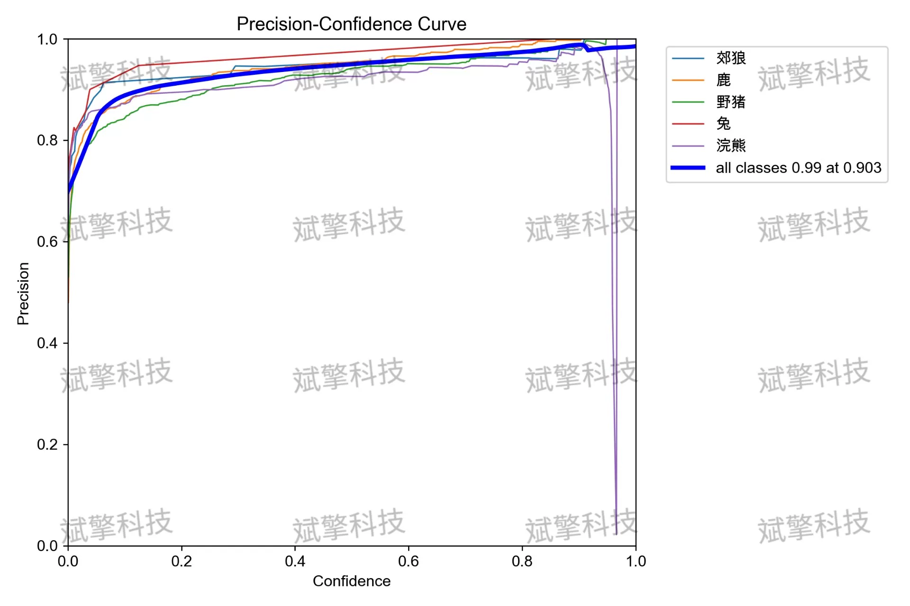
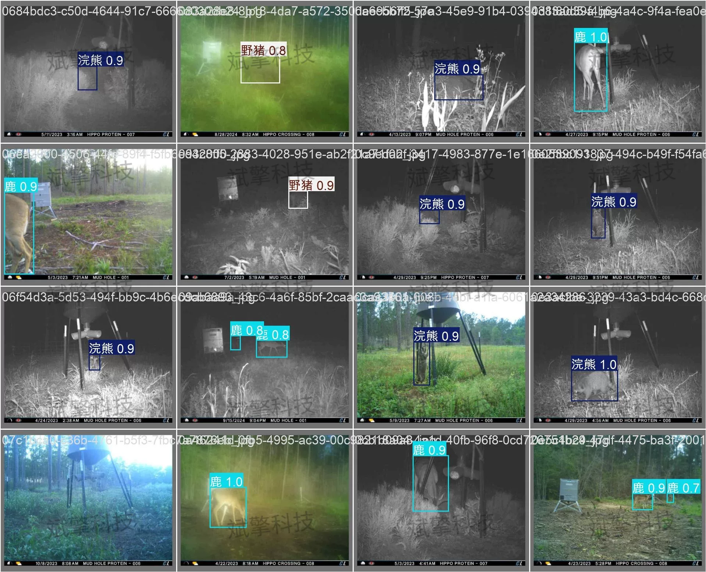

# YOLO26 Wildlife Detection System | UI Interface

## Body

YOLO26 Wildlife Detection System | UI Interface for YOLO26 Wildlife Detection System (Project Source Code + Dataset + Model Weights + UI Interface + Python + Deep Learning + Remote Environment Deployment)

In response to the demand for automatic identification of wild animals in outdoor environments, this paper constructs a wildlife recognition system based on the YOLO26 object detection algorithm. The system includes five categories of targets (Coyote, Deer, Hog, Rabbit, Raccoon), and it is trained on a large-scale dataset consisting of 10,665 training images, 928 validation images, and 536 test images. The experimental results show that the model achieves an overall average precision mAP50 of 0.968 on the validation set, with mAP50-95 reaching 0.737, and an average precision of 0.954, with a recall rate of 0.927. The inference time per image is only 1.8ms, and the overall processing speed is about 2.8ms/image, meeting the requirements for real-time detection. Among the categories, Coyote recognition is the most accurate (mAP50=0.990), while Raccoon recognition is relatively lower (mAP50=0.947). Overall, the proposed system achieves a good balance between detection accuracy and inference efficiency, and has potential for practical deployment in wildlife monitoring and protection work.

The dataset contains five wildlife categories:
Coyote    Coyote    
Deer    Deer    
Hog    Hog    
Rabbit   Rabbit    
Raccoon    Racoon    
The wildlife image dataset constructed in this study consists of 11,593 images, divided into three categories for training, validation, and testing:
Training set   10,665 images    Used for learning model parameters and feature extraction
Validation set   928 images    Used for hyperparameter tuning and model selection during training
Test set       536 images    Used for independent evaluation of final model performance

Free reservation for remote installation. Unsuccessful installation will result in full refund.
Purchase comes with the following resources (unlocked in Baidu Cloud):
YOLO Recognition Detection Project Complete Source Code
YOLO format Dataset
Training Code + UI Interface Code
Trained Model + Results Images
Software Installation Package
Add WeChat for remote installation (Automatically displayed WeChat ID after purchase) - Unsuccessful, full refund

⚙️ Core Functional Modules
Detection Capability
Image Detection: Upon upload, return detection boxes + category information
Video Detection: Supports video files, analyzes frames accurately
Camera Real-Time Detection: Connects to USB cameras, realizes dynamic monitoring
Interaction and Control
Target Filtering: Choose one or more categories for detection
Parameter Real-Time Adjustment: Adjustable confidence threshold & IoU threshold, flexible control of accuracy
Result Save: One-click save of images/videos/camera detection results
System and Data
User Login and Registration: Supports password strength check + encryption storage
Log Recording: Auto-record operation and error information (timestamped)

## Images

## Payment

Here is a pay link on Stripe ( https://buy.stripe.com/3cs8yP7sY87d0vu9AB ). Please contact me lonlonago@foxmail.com after funding $89, and I will send you a complete data files , thank you!

